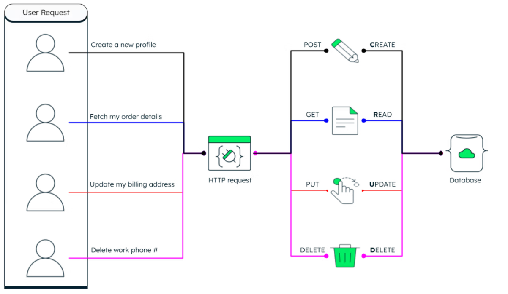
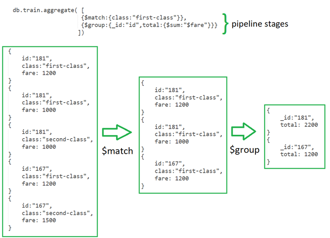

# Lesson 1: Introduction to MongoDB

---


## 1. What is MongoDB?

MongoDB is a leading **NoSQL database**, specifically a **document-oriented database**. It's open-source and cross-platform, designed for high performance, high availability, and automatic scaling. Unlike traditional relational databases, MongoDB stores data in flexible, **JSON-like documents**. This flexibility is a key advantage for modern, agile development.

### Why NoSQL? Why MongoDB?
Traditional relational databases (SQL) have a **rigid schema** and often face **scalability challenges**, primarily relying on vertical scaling (upgrading hardware). Queries can involve complex **joins** for denormalized data, impacting performance.

MongoDB addresses these limitations:
* **Flexible Schema:** Documents in a collection don't need a predefined structure, allowing for rapid iteration and adaptation to changing data requirements.
* **Horizontal Scalability (Sharding):** Designed to distribute data across multiple servers, enabling easy scaling out.
* **High Performance:** The document model often leads to fewer joins, resulting in faster read operations, especially for embedded data.
* **Intuitive for Developers:** Working with JSON-like documents aligns well with modern programming languages and web development paradigms, making it easier for developers.

### MongoDB Architecture & Ecosystem
Understanding MongoDB's core components is essential:
<p align="center">
  
</p>

* **Mongod:** The primary database process that handles data requests, manages storage, and performs core database operations. This is the server.
* **Mongos:** In a **sharded cluster**, `mongos` acts as a query router, directing client queries to the appropriate data shards.
* **Mongo:** The interactive JavaScript shell used by developers and administrators to interact directly with the database, execute commands, and perform queries.

Beyond these, MongoDB has a rich ecosystem:
* **MongoDB Compass:** A graphical user interface (GUI) for visually exploring data, executing queries, and optimizing performance.
* **MongoDB Atlas:** MongoDB's fully managed cloud database service, simplifying deployment, scaling, and maintenance.
* **Drivers:** Official drivers for most popular programming languages (Python, Node.js, Java, C#, etc.) enable applications to seamlessly connect to MongoDB.

### BSON: Binary JSON
While MongoDB documents are JSON-like, internally they are stored in **BSON (Binary JSON)**. BSON is a binary-encoded serialization of JSON-like documents. It's preferred over plain JSON because it's:
* **Lightweight:** Designed for efficient space utilization.
* **Traversable:** Allows for quick parsing and extraction of specific fields without reading the entire document.
* **Efficient:** Offers faster serialization and deserialization compared to text-based JSON.
BSON also extends JSON by supporting more data types, such as `Date`, `ObjectID`, and `BinData`, which are crucial for robust database operations.

### Documents and Collections
These are the fundamental building blocks of data in MongoDB:
* **Documents:** The basic unit of data, structured as **JSON-like key-value pairs**. They are **schema-less**, meaning fields can vary between documents in the same collection. Documents can contain embedded documents (nested objects) and arrays, enabling rich, hierarchical data structures.
* **Collections:** Groups of documents. They are analogous to tables in relational databases but do not enforce a rigid schema. All documents within a collection typically serve a similar purpose (e.g., a `users` collection contains user documents).

---

## 1.1. CRUD Operations in MongoDB
<p align="center">
  
</p>
### Connecting to MongoDB (via Mongo Shell)
Before performing operations, connect to your MongoDB instance:
* Open your terminal and type `mongo` to open the shell.
* Use `show dbs` to list existing databases.
* Use `use <database_name>` to switch to or implicitly create a database.
* Type `db` to confirm the current database.

### Create (Insert) Operations
Inserting new documents into a collection:
* **`db.<collection_name>.insertOne(<document>)`**: Inserts a single document.
    * *Example:* `db.products.insertOne({ name: "Laptop", price: 1200, category: "Electronics" })`
* **`db.<collection_name>.insertMany([<document1>, <document2>, ...])`**: Inserts multiple documents as an array. This is more efficient for bulk operations.
    * *Example:* `db.products.insertMany([{ name: "Mouse", price: 25 }, { name: "Keyboard", price: 75 }])`
    * MongoDB automatically adds a unique `_id` (of type `ObjectID`) if not provided.

### Read (Find) Operations - Basics
Retrieving documents from a collection:
* **`db.<collection_name>.find()`**: Returns all documents in the collection. (Use with caution on large collections).
* **`db.<collection_name>.find(<query_filter>)`**: Returns documents matching the specified criteria.
    * *Example:* `db.products.find({ category: "Electronics" })`
* **`db.<collection_name>.findOne(<query_filter>)`**: Returns the first document that matches the query filter.
    * *Example:* `db.products.findOne({ name: "Laptop" })`

### Query Operators and Filters - Comparison
Used for matching document values against specific conditions:
* **`$eq`**: Equal to (implicit when you provide a field directly, e.g., `{ price: 100 }`).
* **`$ne`**: Not equal to.
    * *Example:* `db.products.find({ category: { $ne: "Books" } })`
* **`$gt`**: Greater than.
* **`$gte`**: Greater than or equal to.
* **`$lt`**: Less than.
* **`$lte`**: Less than or equal to.
    * *Example:* `db.products.find({ price: { $gt: 100 } })`
* **`$in`**: Matches any value in a specified array.
    * *Example:* `db.products.find({ category: { $in: ["Electronics", "Clothing"] } })`
* **`$nin`**: Matches none of the values in a specified array.

### Query Operators and Filters - Logical
Combining multiple query expressions:
* **`$and`**: Joins query clauses with a logical AND. Selects documents that satisfy all expressions. (Implicit when multiple fields are at the top level of a query).
    * *Example:* `db.products.find({ $and: [{ category: "Electronics" }, { price: { $lt: 500 } }] })`
* **`$or`**: Joins query clauses with a logical OR. Selects documents that satisfy at least one expression.
    * *Example:* `db.products.find({ $or: [{ category: "Books" }, { price: { $gt: 1000 } }] })`
* **`$not`**: Inverts the effect of a query expression.
    * *Example:* `db.products.find({ price: { $not: { $gt: 100 } } })` (finds prices <= 100)
* **`$nor`**: Joins query clauses with a logical NOR. Selects documents that fail to match all expressions.

### Query Operators and Filters - Element & Evaluation
* **Element Operators:**
    * **`$exists`**: Matches documents that have (or don't have) the specified field.
        * *Example:* `db.products.find({ description: { $exists: true } })`
    * **`$type`**: Selects documents where the value of a field is of a specified BSON type.
* **Evaluation Operators:**
    * **`$regex`**: Selects documents where values match a regular expression.
        * *Example:* `db.products.find({ name: { $regex: /^L/ } })`
    * **`$text`**: Performs full-text search (requires a text index).

### Read Operations - Projection, Sort, Skip, Limit
Refining read results:
* **Projection (`.find({}, { field: 1, _id: 0 })`)**: Specifies which fields to include (`1`) or exclude (`0`) from the results. By default, `_id` is always included.
    * *Example:* `db.products.find({}, { name: 1, price: 1, _id: 0 })`
* **Sort (`.sort({ field: 1/-1 })`)**: Orders the results. `1` for ascending, `-1` for descending.
    * *Example:* `db.products.find().sort({ price: -1 })`
* **Skip (`.skip(n)`)**: Skips a specified number of documents for pagination.
* **Limit (`.limit(n)`)**: Restricts the number of documents returned.
* **Chaining Methods**: These methods can be chained together (e.g., `db.collection.find().sort().skip().limit()`).

### Update Operations
Modifying existing documents:
* **`db.<collection_name>.updateOne(<filter>, <update_document>)`**: Updates a single document matching the filter.
* **`db.<collection_name>.updateMany(<filter>, <update_document>)`**: Updates all documents matching the filter.
* **Common Update Operators:**
    * **`$set`**: Sets the value of a field. If the field doesn't exist, it adds it.
        * *Example:* `db.products.updateOne({ name: "Laptop" }, { $set: { price: 1250 } })`
    * **`$inc`**: Increments/decrements a numeric field.
        * *Example:* `db.products.updateOne({ name: "Mouse" }, { $inc: { quantity: 1 } })`
    * **`$unset`**: Removes a field from a document.

### Delete Operations
Removing documents or collections:
* **`db.<collection_name>.deleteOne(<filter>)`**: Deletes a single document matching the filter.
* **`db.<collection_name>.deleteMany(<filter>)`**: Deletes all documents matching the filter. **Caution:** `db.collection.deleteMany({})` deletes all documents!
* **`db.<collection_name>.drop()`**: Deletes the entire collection, including all documents and indexes. This is irreversible.

---

## 1.2. Indexing and Aggregation Framework

### Performance Tuning with Indexes
An **index** is a special data structure that stores a small, ordered portion of a collection's data, along with references to the original documents.
* **Why use Indexes?**
    * **Speed up queries:** Reduces the number of documents MongoDB has to scan to find matching data.
    * **Support efficient sorts:** Queries with sort operations can use indexes if the sort order matches the index order.
    * **Enforce uniqueness:** Unique indexes ensure no two documents have the same value for a specified field.
* **Trade-offs:** Indexes consume storage space and can slow down write operations (inserts, updates, deletes) because the index also needs to be updated.

### Creating and Managing Indexes
* **Creating Indexes:**
    * **`db.<collection_name>.createIndex({ <field>: 1/-1 })`**: `1` for ascending, `-1` for descending.
        * *Example (single field):* `db.products.createIndex({ category: 1 })`
    * **Compound indexes**: Indexes on multiple fields. Order matters for query optimization.
        * *Example:* `db.products.createIndex({ category: 1, price: -1 })`
    * **Unique indexes**: Ensures unique values for a field.
        * *Example:* `db.users.createIndex({ email: 1 }, { unique: true })`
* **Viewing Indexes:** `db.<collection_name>.getIndexes()`
* **Dropping Indexes:** `db.<collection_name>.dropIndex("<index_name>")`

### Understanding the Aggregation Framework

<p align="center">
  
</p>

**Aggregation** processes data records and returns computed results. It's used to group values, perform calculations (sums, averages, counts), and transform documents.
* **The Aggregation Pipeline:** A series of data processing **stages**. Documents flow through these stages, where each stage performs an operation (e.g., filtering, grouping, reshaping) and passes its output to the next stage. This allows for powerful and flexible data transformations.

### Aggregation Pipeline Stages - `$match`
* **`$match`**: Filters documents based on specified conditions, similar to a `find()` query.
* **Best Practice**: Place `$match` early in the pipeline to reduce the number of documents processed by subsequent stages, significantly improving performance.
    * *Example:* `db.products.aggregate([{ $match: { category: "Electronics" } }])`

### Aggregation Pipeline Stages - `$group`
* **`$group`**: Groups documents by a specified `_id` expression (the grouping key) and applies **accumulator expressions** to compute results for each group.
* **Common Accumulators:**
    * `$sum`: Calculates a sum.
    * `$avg`: Calculates an average.
    * `$min`, `$max`: Returns minimum/maximum value.
    * `$first`, `$last`: Returns first/last document value in group.
    * *Example:*
        ```javascript
        db.products.aggregate([
            { $group: {
                _id: "$category",
                totalProducts: { $sum: 1 },
                averagePrice: { $avg: "$price" }
            }}
        ])
        ```

### Aggregation Pipeline Stages - `$project`
* **`$project`**: Reshapes each document in the stream by selecting, renaming, adding, or removing fields. It's more powerful than `find()` projection as it allows for calculated fields.
    * *Example:*
        ```javascript
        db.products.aggregate([
            { $project: {
                _id: 0,
                productName: "$name",
                unitPrice: "$price",
                taxedPrice: { $multiply: ["$price", 1.10] }
            }}
        ])
        ```

### Aggregation Pipeline Stages - Other Useful Stages
* **`$sort`**: Sorts documents by a field.
* **`$limit`**: Passes a specified number of documents.
* **`$skip`**: Skips a specified number of documents.
* **`$unwind`**: Deconstructs an array field from the input documents, outputting a document for each element in the array. Very useful for processing data within arrays.
* **`$lookup`**: Performs a left outer join to an unsharded collection in the same database, allowing you to include related data from another collection.

### Aggregation Pipeline Example
**Scenario:** Find the top 3 most expensive products in each category.
```javascript
db.products.aggregate([
    { $sort: { category: 1, price: -1 } }, // Sort by category then price descending
    { $group: {
        _id: "$category",
        topProducts: { $push: { name: "$name", price: "$price" } } // Push all products into an array
    }},
    { $project: {
        _id: 0,
        category: "$_id",
        top3Products: { $slice: ["$topProducts", 3] } // Get the first 3 (most expensive)
    }}
])
```
This example shows how stages are chained: sort first, then group and collect, then project and slice the array.

---

## 1.3. MongoDB Schema Design

### Schema Design in NoSQL
While MongoDB is "schema-less" at the database level, a well-thought-out **logical schema** is crucial for performance, scalability, and maintainability.
* **NoSQL (MongoDB) vs. Relational:**
    * **Relational:** Focuses on normalization, rigid tables, and joins.
    * **MongoDB:** Flexible documents; denormalization (embedding) is often preferred to optimize for read performance and minimize joins.
* **Key Design Principles:**
    * **Data access patterns are paramount:** Design your schema based on how your application will query and use the data.
    * **Balance reads vs. writes:** Embedding often optimizes reads but can impact writes, and vice-versa for referencing.

### Embedding vs. Referencing
The core decision in MongoDB schema design:
* **Embedding (Denormalization):**
    * **Concept:** Store related data directly within a single document (nested).
    * **Pros:** Faster reads (single query), atomic updates for the document, reduced joins, single object access in application.
    * **Cons:** Document size limits (16MB), potential data duplication, complex updates for large embedded arrays.
    * **When to use:** One-to-one or one-to-few relationships, data that is rarely accessed independently, data that changes together.
* **Referencing (Normalization):**
    * **Concept:** Store related data in separate documents/collections and link them using `_id` references, similar to foreign keys.
    * **Pros:** Flexible relationships, avoids document size limits, reduces data duplication, simpler updates to referenced documents.
    * **Cons:** Requires multiple queries (`$lookup` for joins), non-atomic operations across documents.
    * **When to use:** One-to-many or many-to-many relationships, frequently updated data, large or unbounded embedded arrays.
 
   ---
     
# 2. Case Study: MongoDB's Transformative Role at GlobalConnect

## A. Introduction
Consider a fictional company 'GlobalConnect', a leading global SaaS provider offering a suite of collaboration and project management tools, faced escalating challenges with its traditional relational database infrastructure. As their user base expanded and the demand for more dynamic, personalized features grew, their existing SQL database struggled to keep pace, leading to performance bottlenecks and hindering rapid feature deployment. This case study details GlobalConnect's decision to integrate MongoDB into their data architecture to address these issues, ultimately achieving superior data flexibility, scalability, and developer agility.

## B. The Challenge: Relational Database Limitations for Evolving Data
GlobalConnect's primary application relied on a large, centralized MySQL database. While robust for initial needs, its limitations became apparent with rapid growth:

- **Schema Evolution Pains**: The highly structured schema of MySQL made it cumbersome to introduce new features that required varying data attributes, such as custom user fields, dynamic project metadata, or diverse document types. Each change necessitated time-consuming schema migrations and downtime.
- **Scalability Constraints**: Scaling the MySQL database, especially for read-heavy workloads on complex, interconnected data, became increasingly challenging and expensive. Sharding was a complex undertaking, and achieving high availability across geographies was difficult.
- **Performance for Dynamic Queries**: Features requiring flexible querying across diverse user data, like personalized dashboards or advanced search functionalities, often resulted in slow query performance due to complex joins on large tables.
- **Developer Velocity**: Developers spent significant time working around schema rigidity, often normalizing data that would be more naturally represented as nested documents, slowing down the development of new features and product iterations.

## C. The Solution: Embracing MongoDB for Data Agility
After evaluating various NoSQL options, GlobalConnect strategically adopted MongoDB, a document-oriented database, for several key components of their platform, primarily focusing on user profiles, project configurations, and flexible content storage. The decision was based on MongoDB's strengths:

- **Flexible Schema**: MongoDB's document model allowed GlobalConnect to store data in a more natural, nested format, directly mapping to their application objects. This eliminated the need for rigid schema definitions, enabling rapid iteration on features with evolving data requirements.
- **Scalability for Growth**: MongoDB's native sharding capabilities provided a straightforward path to horizontally scale their database across multiple servers, distributing data and load effectively to handle increasing user volumes and data size.
- **High Performance for Dynamic Data**: Queries on nested documents were often faster and more efficient than complex joins in a relational database, particularly for retrieving aggregate information or specific subsets of diverse data.
- **Developer Familiarity**: MongoDB's JSON-like document structure resonated well with their developer teams already working with JSON in their application layer, shortening the learning curve and improving productivity.

## D. Implementation Strategy
GlobalConnect followed a careful, phased implementation approach:

- **Initial Pilot (User Profiles)**: They began by migrating the user profile management system to MongoDB. This allowed them to immediately experience the benefits of a flexible schema for custom user attributes and preferences.
- **Progressive Module Migration**: Subsequently, project configurations, notifications, and certain types of user-generated content were migrated to MongoDB. Data consistency was maintained during this period using robust synchronization layers between MySQL and MongoDB where necessary.
- **Microservices Integration**: As GlobalConnect moved towards a microservices architecture, MongoDB naturally fit into this paradigm, allowing individual services to own and manage their specific data models within MongoDB collections.
- **Operational Readiness**: Comprehensive monitoring, backup, and disaster recovery strategies were put in place for the MongoDB clusters, along with internal training for operations teams.

## E. Results and Transformative Benefits
The strategic adoption of MongoDB brought substantial improvements to GlobalConnect's platform and development process:

- **Unprecedented Data Flexibility**: New features requiring diverse data structures could be developed and deployed in days rather than weeks, as schema changes were no longer a bottleneck. This significantly accelerated product innovation.
- **Seamless Scalability**: GlobalConnect successfully scaled its user base by over 50% within a year without any performance degradation, thanks to MongoDB's horizontal scaling capabilities. Peak load management became significantly more efficient.
- **Improved Application Performance**: Response times for personalized user dashboards, custom reporting, and dynamic content retrieval saw an average improvement of 40-60%, enhancing the overall user experience.
- **Increased Developer Productivity**: Developers reported a significant boost in productivity, spending less time on data modeling and migration concerns and more time on core feature development. The "code-to-data" mapping became much more intuitive.
- **Reduced Operational Complexity**: While sharding still requires management, MongoDB's native features simplified the process compared to manual sharding solutions for relational databases, leading to more streamlined operations.

## F. Conclusion
GlobalConnect's experience underscores MongoDB's power as a key enabler for modern, agile software development and scalable data management. By thoughtfully integrating MongoDB into their architecture for use cases demanding flexibility and horizontal scalability, GlobalConnect not only overcame critical database limitations but also positioned itself for continued rapid innovation and sustained growth in a competitive SaaS market. MongoDB proved to be a pivotal technology in their journey towards a more adaptable and high-performing platform. 

---

# 3. Activities

### Activity 1. Advanced Querying and Projections

**Objective:** This activity will challenge you to write more specific and efficient queries using a wider range of MongoDB query operators. You'll also learn to shape your query results using projections.

**Instructions:** [Download Movie Dataset CSV](./L1_Assests/Movie%20Dataset.csv)

**A. Movies with High IMDb and Metacritic Scores:**
 - Find all movies released after 2010 that have an IMDb rating greater than 8.5 AND a Metacritic score greater than 80.
 - Only display their title, director, year, and their IMDb and Metacritic ratings.

**B. Movies by Specific Directors or Genres:**
 - Find movies directed by "Quentin Tarantino" OR "Steven Spielberg".
 - Additionally, filter these results only to include movies that are either "Sci-Fi" or "Animation" genres.
 - Show only the title, director, and genres fields.
   
**C. Movies with Specific Cast Members (Case-Insensitive) and No Metacritic Score:**
 - Find movies that feature "Leonardo DiCaprio" OR "Tom Hanks" in the cast (case-insensitive search for names).
 - Include only movies where the `ratings.metacritic` field exists.
 - Display title, cast, and `ratings.metacritic`.

**D. Oscar-Nominated Dramas with a Specific Number of Nominations:**
 - Find movies that are Oscar-nominated, are of the "Drama" genre, and have received between 5 and 10 (inclusive) Oscar nominations.
   
---

 ### Activity 2. Intermediate Aggregation Pipeline

**Objective:** This activity will further develop your aggregation skills by combining multiple pipeline stages to derive meaningful insights from the dataset.

**Instructions:** [Download Movie Dataset CSV](./L1_Assests/Movie%20Dataset.csv)

**A. Directors by Average Rotten Tomatoes Score (Top 3):**
 - Calculate the average Rotten Tomatoes rating for each director.
 - Filter out directors who have fewer than 2 movies in the dataset.
 - Sort the results by the average Rotten Tomatoes rating in descending order.
 - Limit the output to the top 3 directors.

**B. Oscar-Winning Movies by Decade:**
 - Group movies by the decade they were released (e.g., 1990s, 2000s).
 - Count how many Oscar-winning movies `(awards.oscarsWon > 0)` fall into each decade.
 - Also, calculate the total number of Oscar wins for each decade.
 - Sort the decades in ascending order.

**C. Top 5 Actors by Total IMDb Rating of Their Movies:**
 - Unwind the cast array to treat each actor's movie as a separate document.
 - Group by actor and calculate the sum of IMDb ratings for all movies they've been in.
 - Sort by the total IMDb rating in descending order.
 - Limit to the top 5 actors.

---

 ### Activity 3. Personal Blog System

**Objective:** To design and implement a simple MongoDB-based database to manage a personal blog system, using the structure and content provided in the `post.csv` file. The system should allow efficient storage, retrieval, and management of blog posts, including metadata such as title, author, content, tags, and timestamps. The goal is to transition from a flat CSV data format to a structured, queryable, and scalable NoSQL data model using MongoDB, thereby enhancing data organization and supporting future blog application development.

**Instructions:** 
 - [Download posts CSV](./L1_Assests/posts.csv)
 - Based on the following data model, create two collections in MongoDB: `posts` and `comments`. Use the field definitions to structure your documents accordingly.

***posts Collection Fields:***
```js
{
  _id: ObjectID, // MongoDB's default ObjectID
  title: String,
  content: String,
  author: String,
  tags: [String], // e.g., ["MongoDB", "NoSQL", "Tutorial"]
  publishedDate: Date,
  status: String, // e.g., "draft", "published"
  views: Number // default to 0
}
```
***comments Collection Fields:***

```js
{
  _id: ObjectID, // MongoDB's default ObjectID
  postId: ObjectID, // Reference to the _id of the related post
  author: String,
  commentText: String,
  commentDate: Date
}
```
**Tasks:**

**A. Data Insertion:**
 - Insert CSV data into the `posts` collection.
 - For one post, insert 2–3 sample comments into the `comments` collection, ensuring `postId` correctly references the `_id` of that post.

**B. Querying Posts:**
 - Find all published posts.
 - Find posts with a specific tag (e.g., "MongoDB").
 - Find posts published in a specific year.
 - Find the title and author of all posts, sorted by `publishedDate descending`.

**C. Updating Posts:**
 - Change the status of a draft post to published.
 - Increment the views count for a specific post.

**D. Aggregations:**
 - Count the total number of posts by each author.
 - Find the post with the most views.

