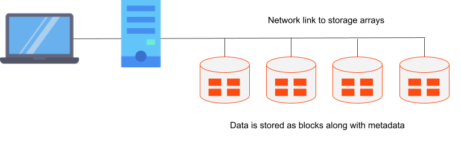
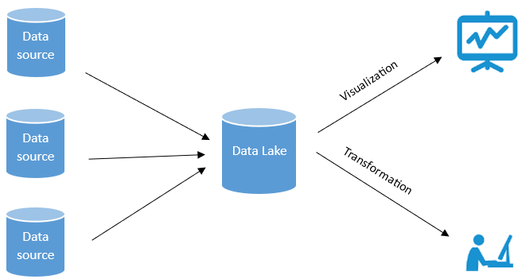

### **1. Introduction to Big Data Storage**

The exponential growth of data generated from digital sources such as applications, IoT devices, social media, and transactional systems presents a significant engineering challenge. The effective storage of this "big data" is a critical foundation for any data-driven organization.

The core challenges of big data are commonly defined by the "5 Vs":

  

  

Source: 5V's of Big Data (Neue Fische, 2025)

* **Volume**: Pertains to the massive scale of the data, often measured in petabytes and exabytes.
* **Velocity**: Refers to the high rate at which data is generated and ingested.
* **Variety**: Describes the diverse nature of the data, which can be structured, semi-structured, or unstructured.
* **Veracity**: Addresses the inherent inconsistencies, noise, and uncertainty within the data.
* **Value**: Represents the ultimate objective of extracting meaningful business insights.

Effective storage solutions for this environment must be designed for scalability, fault tolerance, cost-efficiency, and high-performance data access.

---

### **2. Categories of Big Data Storage Solutions**

Big Data storage technologies are broadly classified based on their architecture and optimal use cases:

| Category                 | Examples                            | Primary Use Case                                                                         |
| :----------------------- | :---------------------------------- | :--------------------------------------------------------------------------------------- |
| **Distributed File Systems** | HDFS, GlusterFS, CephFS       | Large-scale, sequential batch processing and raw data storage.                         |
| **NoSQL Databases** | MongoDB, Cassandra, HBase       | Applications requiring high-velocity data ingestion and flexible data models for semi-structured data. |
| **Object Storage** | Amazon S3, Google Cloud Storage | Storing large binary files, unstructured data objects, and backups.            |
| **Data Lakes** | Azure Data Lake, Amazon S3 + Glue | Centralized repositories for analytics and machine learning workloads.                 |
| **Cloud Storage** | AWS, Azure, GCP                 | Elastic, globally available, and cost-effective cloud-native storage infrastructure.      |

---

### **3. Distributed File Systems (DFS)**

A Distributed File System abstracts a network of multiple machines to present a single, logical file system to the user.

  

Reference: DFS Architecture (TechTarget, 2025)

**Key Architectural Characteristics:**
* **Block-based Storage**: Files are segmented into large, fixed-size blocks (e.g., 128MB or 256MB) and distributed across the nodes of the cluster.
* **Data Replication**: Each block is replicated multiple times across different nodes to ensure fault tolerance. The failure of a single node does not lead to data loss, as replicas are available elsewhere in the cluster.
* **Parallel Processing Support**: The distributed nature of the data allows for massively parallel processing, where computational tasks can be executed on the nodes where the data resides, minimizing data movement.

**Prominent Example: HDFS (Hadoop Distributed File System)**
HDFS is the foundational storage layer of the Hadoop ecosystem, designed for high-throughput access to large datasets.
* It utilizes a master-slave architecture, with a central **NameNode** managing the file system's metadata (i.e., the directory structure and location of data blocks) and multiple **DataNodes** storing the actual blocks.
* It is highly optimized for write-once-read-many access patterns, making it ideal for batch processing frameworks like MapReduce and Spark.

---

### **4. NoSQL Databases**

The term NoSQL ("Not Only SQL") refers to a class of databases designed to handle data models and scaling characteristics that traditional relational database management systems (RDBMS) do not. They excel at managing semi-structured or unstructured data and support horizontal scaling.

  

Reference: NoSQL Databases (Algomaster, 2024)

**Primary Types of NoSQL Databases:**
* **Document Databases (e.g., MongoDB)**: Store data in flexible, self-describing document formats such as JSON or BSON. Each document can have a different structure, providing high schema flexibility.
* **Columnar Databases (e.g., Apache Cassandra, HBase)**: Organize data by columns rather than rows. This architecture is highly efficient for analytical queries that access a subset of columns across a large number of records.
* **Key-Value Stores (e.g., Redis, DynamoDB)**: Employ a simple data model consisting of a unique key paired with a value. This model facilitates extremely fast lookups and is suitable for caching and session management.
* **Graph Databases (e.g., Neo4j)**: Are purpose-built to store and navigate relationships between entities. They are optimized for use cases like social networks, fraud detection, and recommendation engines.

---

### **5. Object Storage**

Object storage is an architecture that manages data as distinct units, or objects, rather than as files in a hierarchy or as blocks on a disk.

**Core Components of an Object:**
1.  **Data**: The content itself.
2.  **Metadata**: A set of user-defined, extensible information about the data.
3.  **Unique Identifier**: A globally unique ID used to access the object via a flat address space.

**Key Features:**
* **Scalability**: Object storage systems offer virtually unlimited scalability.
* **API-driven Access**: Objects are typically accessed via REST APIs, making this model highly suitable for cloud and web applications.
* **Cost-Effectiveness**: It is a highly cost-effective solution for storing warm or cold data, such as archives and backups.

**Prominent Options:** Amazon S3, Azure Blob Storage, and Google Cloud Storage.

---

### **6. Data Lakes**

A Data Lake is a centralized repository designed to store vast quantities of structured, semi-structured, and unstructured data at any scale.

  

Source: Datalakes (Nekouš, 2024)

**Distinguishing Traits:**
* **Schema-on-Read**: Unlike a traditional data warehouse which employs a "schema-on-write" model (requiring data to be structured before ingestion), a data lake allows raw data to be loaded without a predefined schema. The structure is applied during data retrieval and analysis. This provides maximum flexibility for data exploration.
* **Support for Diverse Workloads**: Data lakes serve as the foundation for a wide range of analytics, data science, and machine learning tasks.
* **Tiered Data Storage**: They often contain zones for raw, curated, and processed data to manage the data lifecycle.

---

### Netflix's Data Storage Architecture

Netflix employs a sophisticated, polyglot persistence strategy to manage data for its global streaming service.

**Solutions Deployed:**
* **Amazon S3**: Functions as the core object storage layer and the company's primary data lake. It stores raw event logs, processed data, and media assets. Its selection is driven by its scalability, durability, and cost-efficiency.
* **Apache Cassandra**: A columnar NoSQL database used for managing real-time user state information, such as viewing history. This choice is justified by Cassandra's high write performance and robust multi-region replication capabilities, which ensure high availability.
* **DynamoDB**: A key-value database used within the microservices architecture for high-speed metadata lookups.
* **Apache Iceberg**: An open table format used on top of the S3 data lake to manage large analytical datasets, enabling reliable transactions and schema evolution.

This multi-faceted approach enables Netflix to achieve massive scalability, high availability, and the capacity for real-time personalization at a petabyte scale.
