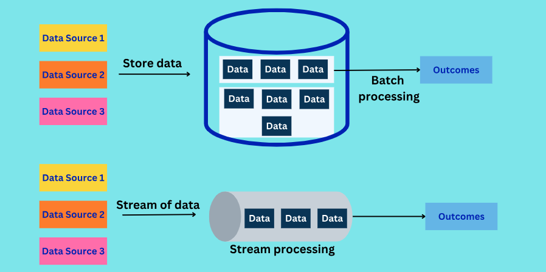

# Batch vs. Stream Processing: A Data Engineering Deep Dive

## Introduction

In the world of data, raw information is rarely useful in its unprocessed form. To extract insights, make decisions, and drive business value, we need to process it.

### What is Data Processing?

Data processing is the act of transforming raw data into meaningful and usable information. Think of it like refining crude oil into various useful products – data processing refines raw data into actionable intelligence. This can involve cleaning, transforming, aggregating, and analyzing data.

### Why Process Data?

Data processing is fundamental to almost every business operation. Let's look at a couple of simple business cases:

* **Billing:** Imagine a telecommunications company. Every phone call, every text message, every gigabyte of data consumed generates a record. To accurately bill customers at the end of the month, all these individual records need to be collected, aggregated, and processed to calculate the total usage and charges. This is a classic example of data processing.

* **Dashboarding:** A sales manager needs to see how their team is performing. They want a dashboard showing daily sales figures, top-selling products, and regional performance. This dashboard doesn't just magically appear; it's fed by processed sales data, often aggregated from various sources and transformed into a format suitable for visualization.

## Batch Processing vs Stream Processing

  <p align="center">
  
</p>

## Batch Processing

### Definition

Batch processing is a method of processing data in large chunks or "batches" at specific intervals. Instead of processing data as it arrives, batch processing collects data over a period and then processes all of it together in a single run.

### Characteristics

* **High Latency:** Since data is collected and processed at intervals, there's an inherent delay between when data is generated and when it's processed and available for use. This delay is known as high latency.
* **Scheduled Jobs:** Batch processes are typically scheduled to run at predetermined times, such as nightly, weekly, or monthly.
* **Large Data Volumes:** Batch processing is well-suited for handling massive datasets that accumulate over time.
* **Resource Intensive (during execution):** When a batch job runs, it often consumes significant computing resources for the duration of its execution.
* **Historical Analysis:** It's ideal for analyzing historical data and generating reports based on past events.

### Real-world Examples:

* **Daily Sales Reports:** At the end of each business day, all sales transactions for that day are collected and processed to generate a comprehensive daily sales report for management. This report isn't needed in real-time throughout the day, but rather as an end-of-day summary.
* **Monthly Payroll Processing:** Companies typically process payroll once or twice a month. All employee work hours, deductions, and benefits for the entire period are collected and processed together to calculate salaries and generate paychecks.

### Tools:

* **Apache Hadoop (brief):** Hadoop is an open-source framework for distributed storage and processing of very large datasets. Its MapReduce component is a classic example of a batch processing engine, breaking down large problems into smaller, parallelizable tasks.
* **Apache Spark (Batch mode):** Spark is a powerful unified analytics engine for large-scale data processing. While it can do much more, its core RDD (Resilient Distributed Dataset) API and DataFrame API are extensively used for efficient batch processing of structured and unstructured data.
* **SQL-based ETL tools (e.g., Talend, Informatica – optional mention):** These tools are widely used for Extract, Transform, Load (ETL) operations, which are often batch-oriented. They provide graphical interfaces to design data pipelines that move and transform data from various sources into data warehouses or other destinations.

## Stream Processing

### Definition

Stream processing is a method of processing data continuously as it arrives, in real-time or near real-time. Instead of waiting for a batch to accumulate, data streams are processed event by event, or in very small micro-batches.

### Characteristics

* **Low Latency:** Data is processed almost instantly after it's generated, resulting in very low latency. This is crucial for applications requiring immediate insights.
* **Near Real-time:** While true "real-time" is often aspirational, stream processing aims for processing within milliseconds or seconds of data arrival.
* **Continuous Flow:** Data is treated as a continuous, unbounded stream of events.
* **Event-Driven:** Processing is triggered by the arrival of individual data events.
* **Immediate Action:** Ideal for scenarios where immediate action or alerts are required based on incoming data.

### Real-world Examples:

* **Fraud Detection:** When you make a credit card transaction, banks use stream processing to analyze the transaction in real-time for suspicious patterns. If a transaction deviates significantly from your usual spending habits, it can be flagged as potentially fraudulent within milliseconds, preventing unauthorized purchases.
* **Live Analytics on Web Traffic:** E-commerce websites use stream processing to monitor website traffic in real-time. They can see how many users are currently on the site, which pages they are visiting, and quickly identify if there's a sudden surge in traffic or an issue affecting user experience.

### Tools:

* **Apache Kafka (intro to messaging):** Kafka is a distributed streaming platform that acts as a high-throughput, fault-tolerant message broker. It's not a processing engine itself but is fundamental for building stream processing applications as it efficiently collects and delivers data streams to processing engines.
* **Apache Spark Structured Streaming:** Built on the Spark SQL engine, Structured Streaming provides a high-level API for continuous processing of data streams. It allows you to express your streaming computations as if they were batch computations, and Spark handles the incremental execution.
* **Apache Flink (briefly):** Flink is a powerful open-source stream processing framework designed for high-throughput, low-latency, and fault-tolerant stream processing. It's often chosen for very demanding real-time applications.
* **AWS Kinesis / GCP PubSub (optional cloud view):** These are cloud-native managed services that provide similar functionalities to Apache Kafka for building real-time data streaming applications. They abstract away the infrastructure management, making it easier to build scalable streaming solutions in the cloud.

## 📌 Comparison Table

| Feature          | Batch Processing              | Stream Processing             |
| :--------------- | :---------------------------- | :---------------------------- |
| **Latency** | High                          | Low                           |
| **Data Size** | Large volumes (historical)    | Real-time events (continuous) |
| **Use Case** | Historical analysis, reporting, monthly billing | Real-time alerts, fraud detection, live dashboards |
| **Processing Style** | Collect then process          | Process as it arrives         |
| **Data Boundness** | Bounded (finite)              | Unbounded (infinite)          |

## 📌 Demo or Activity

### Simple Python Batch Script vs. Kafka Consumer Script

Let's illustrate the fundamental difference with simplified Python examples.

**Scenario:** We have a stream of "sensor readings" (imagine temperature, humidity, etc.).

#### 1. Batch Processing: Reading from a File (Simulating a Daily Batch)

Here, we'll simulate collecting all "daily" readings into a file and then processing them all at once.


```
# batch_processor.py
import time

def process_daily_readings(filename="daily_readings.txt"):
    print(f"--- Batch Processing: Reading from {filename} ---")
    total_readings = 0
    sum_temperature = 0

    try:
        with open(filename, 'r') as f:
            for line in f:
                try:
                    temperature = float(line.strip())
                    sum_temperature += temperature
                    total_readings += 1
                    print(f"Processed batch reading: {temperature}°C")
                    time.sleep(0.01) # Simulate some processing time per reading
                except ValueError:
                    print(f"Skipping invalid line: {line.strip()}")

        if total_readings > 0:
            average_temperature = sum_temperature / total_readings
            print(f"\nBatch Job Complete!")
            print(f"Total readings processed: {total_readings}")
            print(f"Average temperature for the day: {average_temperature:.2f}°C")
        else:
            print("No readings to process in the batch.")

    except FileNotFoundError:
        print(f"Error: {filename} not found. Please create it with some readings.")

if __name__ == "__main__":
    # Simulate generating daily readings (you'd typically have a separate script for this)
    with open("daily_readings.txt", 'w') as f:
        for i in range(1, 11):
            f.write(f"{20 + i}\n") # Example temperatures

    print("Daily readings file created. Running batch processing in 5 seconds...")
    time.sleep(5)
    process_daily_readings()
```

**How to Run (Terminal):**
1.  Save the code as `batch_processor.py`.
2.  Run: `python batch_processor.py`

**Explanation:** Notice how the script first prepares the entire "daily\_readings.txt" file. Then, the `process_daily_readings` function opens the file, reads *all* lines, and processes them sequentially. The "results" (average temperature) are only available *after* all readings have been processed.

#### 2. Stream Processing: Simple Kafka Consumer Script (Conceptual)

This requires a running Kafka instance (which is beyond a simple Python script demo) but shows the concept. We'll use the `kafka-python` library.

**Prerequisites (Conceptual - you'd need Kafka running):**
* Install `kafka-python`: `pip install kafka-python`
* Have a Kafka broker running (e.g., local setup with Docker, or a cloud service).
* Have a Kafka topic (e.g., `sensor_readings`).


```
# stream_consumer.py
from kafka import KafkaConsumer
import json
import time

# Configuration for your Kafka broker
KAFKA_BROKER = 'localhost:9092' # Replace with your Kafka broker address
KAFKA_TOPIC = 'sensor_readings'

def consume_sensor_data():
    print(f"--- Stream Processing: Listening to Kafka topic '{KAFKA_TOPIC}' ---")
    consumer = KafkaConsumer(
        KAFKA_TOPIC,
        bootstrap_servers=[KAFKA_BROKER],
        auto_offset_reset='latest', # Start consuming from the latest message
        enable_auto_commit=True,
        group_id='sensor_processing_group',
        value_deserializer=lambda x: json.loads(x.decode('utf-8')) # Assuming JSON messages
    )

    print("Waiting for messages...")
    try:
        for message in consumer:
            sensor_data = message.value
            timestamp = sensor_data.get('timestamp')
            temperature = sensor_data.get('temperature')

            if timestamp and temperature is not None:
                print(f"Real-time processing: At {timestamp}, Temperature is {temperature}°C")
                # Here you'd apply your real-time logic, e.g.,
                # - Send an alert if temperature > 30
                # - Update a real-time dashboard
                # - Store in a time-series database
                if temperature > 28:
                    print(f"  ALERT: High temperature detected! {temperature}°C")
            else:
                print(f"Received malformed message: {sensor_data}")
            time.sleep(0.05) # Simulate quick processing
    except KeyboardInterrupt:
        print("\nStopping consumer.")
    finally:
        consumer.close()

if __name__ == "__main__":
    # This script *listens*. You'd have another script or process (a 'producer')
    # sending messages to the 'sensor_readings' topic.
    # Example Producer (conceptual, for demonstration you'd run this separately):
    """
    from kafka import KafkaProducer
    import json
    import datetime
    import random

    producer = KafkaProducer(
        bootstrap_servers=['localhost:9092'],
        value_serializer=lambda v: json.dumps(v).encode('utf-8')
    )

    for i in range(100):
        data = {
            'timestamp': datetime.datetime.now().isoformat(),
            'sensor_id': f'sensor_{random.randint(1,5)}',
            'temperature': round(random.uniform(20.0, 32.0), 2)
        }
        producer.send('sensor_readings', data)
        print(f"Sent: {data}")
        time.sleep(1)
    producer.flush()
    """

    print("This script is a Kafka consumer. To see it in action, you need:")
    print("1. A Kafka broker running (e.g., `docker-compose up` for a local setup).")
    print("2. A Kafka producer sending messages to the topic 'sensor_readings'.")
    print("\nStarting consumer (will wait for messages)...")
    consume_sensor_data()
```

**How to Run (Conceptual):**
1.  Set up a Kafka environment.
2.  Save the code as `stream_consumer.py`.
3.  Run: `python stream_consumer.py`
4.  In a separate terminal, run a Kafka producer (e.g., the conceptual producer code above, or use `kafka-console-producer.sh`).

**Explanation:** The `KafkaConsumer` continuously polls for new messages on the `sensor_readings` topic. As soon as a message arrives, it's processed *individually*. This allows for immediate actions like printing an alert if the temperature exceeds a threshold, demonstrating low latency and real-time responsiveness.

## Case Study with Company Name: "OmniRetail Analytics"

**Company Background:**
OmniRetail Analytics is a rapidly growing e-commerce company that sells a wide range of products online. They operate across multiple regions and have a high volume of daily transactions, website visitors, and customer interactions.

**Data Challenges and Solutions:**

**1. Historical Sales Performance & Forecasting (Batch Processing Use Case):**

* **Challenge:** OmniRetail needs to understand its sales trends over months and years, identify best-selling products by season, analyze regional performance, and forecast future demand to optimize inventory and marketing campaigns. This requires aggregating vast amounts of historical transaction data.
* **Why Batch Processing?** These analyses don't need to be minute-by-minute. A daily or weekly refresh is sufficient. The data volume is massive, making batch processing efficient for summarizing and analyzing historical patterns.
* **Solution:** OmniRetail implemented a batch processing pipeline using **Apache Spark (in batch mode)** running on a distributed cluster.
    * **Process:** Every night, transaction data from various sources (online store, payment gateways, CRM) is extracted. Spark jobs then clean, transform, and aggregate this data. For example, they calculate total sales per product, per region, and per marketing campaign for the day. This aggregated data is then loaded into their data warehouse (e.g., Snowflake or Redshift).
    * **Outcome:** Business analysts and marketing teams can access refreshed dashboards and reports each morning, providing insights into yesterday's performance, allowing them to make informed decisions about pricing, promotions, and inventory. Forecasting models are also trained on this historical data.

**2. Real-time Fraud Detection & Personalized Recommendations (Stream Processing Use Case):**

* **Challenge:** OmniRetail faced increasing issues with fraudulent transactions, leading to chargebacks and financial losses. Additionally, they wanted to provide immediate, personalized product recommendations to customers Browse their website, improving conversion rates.
* **Why Stream Processing?** Fraud detection requires immediate action to prevent financial loss. Personalized recommendations are most effective when they adapt in real-time to a user's current Browse behavior. High latency here would be detrimental.
* **Solution:** OmniRetail deployed a robust stream processing architecture using **Apache Kafka** and **Apache Spark Structured Streaming**.
    * **Process - Fraud Detection:** As soon as a customer attempts a purchase, the transaction details are immediately sent as a message to an **Apache Kafka** topic. A **Spark Structured Streaming** application continuously consumes these messages. This application uses machine learning models (trained offline using batch data) to analyze transaction patterns (e.g., unusual purchase amounts, frequent changes in shipping address, rapid successive purchases from different locations). If a transaction is flagged as suspicious, an immediate alert is sent to the fraud detection team, and the transaction might be temporarily held for review or even blocked.
    * **Process - Personalized Recommendations:** Similarly, user clickstreams, search queries, and viewed product details are streamed to another **Kafka** topic. A separate **Spark Structured Streaming** application processes these events in real-time. It uses algorithms to understand the user's current intent and Browse context, generating personalized product recommendations that appear instantly on the website or in the shopping cart, significantly improving the user experience and driving sales.
    * **Outcome:** Drastically reduced fraud losses due to real-time intervention. Increased customer engagement and conversion rates due to highly relevant and timely product recommendations.

This case study for OmniRetail Analytics clearly demonstrates how both batch and stream processing are not mutually exclusive but rather complementary, addressing different business needs within the same organization.

<div class="md-recitation">
  Sources
  <ol>
  <li><a href="https://github.com/LewisDC/pinterest-data-processing-pipeline678">https://github.com/LewisDC/pinterest-data-processing-pipeline678</a></li>
  <li><a href="https://juejin.cn/post/7317703256805359666">https://juejin.cn/post/7317703256805359666</a></li>
  </ol>
</div>
