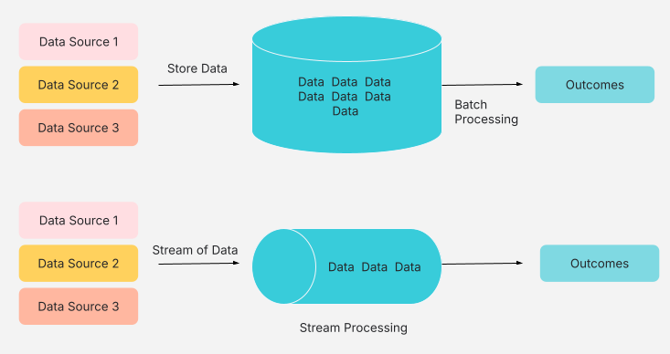

# 1. Introduction to Batch vs. Stream Processing

In the world of data, raw information is rarely useful in its unprocessed form. To extract insights, make decisions, and drive business value, we need to process it.

### What is Data Processing?

Data processing is the act of transforming raw data into meaningful and usable information. Think of it like refining crude oil into various useful products – data processing refines raw data into actionable intelligence. This can involve cleaning, transforming, aggregating, and analyzing data.

### Why Process Data?

Data processing is fundamental to almost every business operation. Let's look at a couple of simple business cases:

* **Billing:** Imagine a telecommunications company. Every phone call, every text message, every gigabyte of data consumed generates a record. To accurately bill customers at the end of the month, all these individual records need to be collected, aggregated, and processed to calculate the total usage and charges. This is a classic example of data processing.

* **Dashboarding:** A sales manager needs to see how their team is performing. They want a dashboard showing daily sales figures, top-selling products, and regional performance. This dashboard doesn't just magically appear; it's fed by processed sales data, often aggregated from various sources and transformed into a format suitable for visualization.
---

## 2. Batch Processing vs Stream Processing

  <p align="center">
  
</p>
 <p align="center">
 Reference: Batch Vs Stream Processing (Design Gurus, NA)

---
   
## 3. Batch Processing

### Definition

Batch processing is a method of processing data in large chunks or "batches" at specific intervals. Instead of processing data as it arrives, batch processing collects data over a period and then processes all of it together in a single run.

### Characteristics

* **High Latency:** Since data is collected and processed at intervals, there's an inherent delay between when data is generated and when it's processed and available for use. This delay is known as high latency.
* **Scheduled Jobs:** Batch processes are typically scheduled to run at predetermined times, such as nightly, weekly, or monthly.
* **Large Data Volumes:** Batch processing is well-suited for handling massive datasets that accumulate over time.
* **Resource Intensive (during execution):** When a batch job runs, it often consumes significant computing resources for the duration of its execution.
* **Historical Analysis:** It's ideal for analyzing historical data and generating reports based on past events.

### Real-world Examples:

* **Daily Sales Reports:** At the end of each business day, all sales transactions for that day are collected and processed to generate a comprehensive daily sales report for management. This report isn't needed in real-time throughout the day, but rather as an end-of-day summary.
* **Monthly Payroll Processing:** Companies typically process payroll once or twice a month. All employee work hours, deductions, and benefits for the entire period are collected and processed together to calculate salaries and generate paychecks.

### Tools:

* **Apache Hadoop:** Hadoop is an open-source framework for distributed storage and processing of very large datasets. Its MapReduce component is a classic example of a batch processing engine, breaking down large problems into smaller, parallelizable tasks.
* **Apache Spark (Batch mode):** Spark is a powerful unified analytics engine for large-scale data processing. While it can do much more, its core RDD (Resilient Distributed Dataset) API and DataFrame API are extensively used for efficient batch processing of structured and unstructured data.
* **SQL-based ETL tools (e.g., Talend, Informatica):** These tools are widely used for Extract, Transform, Load (ETL) operations, which are often batch-oriented. They provide graphical interfaces to design data pipelines that move and transform data from various sources into data warehouses or other destinations.
---

## 4. Stream Processing

### Definition

Stream processing is a method of processing data continuously as it arrives, in real-time or near real-time. Instead of waiting for a batch to accumulate, data streams are processed event by event, or in very small micro-batches.

### Characteristics

* **Low Latency:** Data is processed almost instantly after it's generated, resulting in very low latency. This is crucial for applications requiring immediate insights.
* **Near Real-time:** While true "real-time" is often aspirational, stream processing aims for processing within milliseconds or seconds of data arrival.
* **Continuous Flow:** Data is treated as a continuous, unbounded stream of events.
* **Event-Driven:** Processing is triggered by the arrival of individual data events.
* **Immediate Action:** Ideal for scenarios where immediate action or alerts are required based on incoming data.

### Real-world Examples:

* **Fraud Detection:** When you make a credit card transaction, banks use stream processing to analyze the transaction in real-time for suspicious patterns. If a transaction deviates significantly from your usual spending habits, it can be flagged as potentially fraudulent within milliseconds, preventing unauthorized purchases.
* **Live Analytics on Web Traffic:** E-commerce websites use stream processing to monitor website traffic in real-time. They can see how many users are currently on the site, which pages they are visiting, and quickly identify if there's a sudden surge in traffic or an issue affecting user experience.

### Tools:

* **Apache Kafka:** Kafka is a distributed streaming platform that acts as a high-throughput, fault-tolerant message broker. It's not a processing engine itself but is fundamental for building stream processing applications as it efficiently collects and delivers data streams to processing engines.
* **Apache Spark Structured Streaming:** Built on the Spark SQL engine, Structured Streaming provides a high-level API for continuous processing of data streams. It allows you to express your streaming computations as if they were batch computations, and Spark handles the incremental execution.
* **Apache Flink:** Flink is a powerful open-source stream processing framework designed for high-throughput, low-latency, and fault-tolerant stream processing. It's often chosen for very demanding real-time applications.
* **AWS Kinesis / GCP PubSub:** These are cloud-native managed services that provide similar functionalities to Apache Kafka for building real-time data streaming applications. They abstract away the infrastructure management, making it easier to build scalable streaming solutions in the cloud.
---

##  5. Comparison Table

| Feature          | Batch Processing              | Stream Processing             |
| :--------------- | :---------------------------- | :---------------------------- |
| **Latency** | High                          | Low                           |
| **Data Size** | Large volumes (historical)    | Real-time events (continuous) |
| **Use Case** | Historical analysis, reporting, monthly billing | Real-time alerts, fraud detection, live dashboards |
| **Processing Style** | Collect then process          | Process as it arrives         |
| **Data Boundness** | Bounded (finite)              | Unbounded (infinite)          |

---

## 6. Activity - Simple Python Batch Script vs. Kafka Consumer Script

**Objective:** To illustrate the core differences between batch and stream processing by using Python to simulate sensor data handling—processing a file in batch mode and consuming real-time messages via Kafka. This activity highlights differences in latency, data flow, and responsiveness between the two models.


### Instructions

Let's illustrate the fundamental difference with simplified Python examples.

**Scenario:** We have a stream of "sensor readings" (imagine temperature, humidity, etc.).

#### 1. Batch Processing: Reading from a File (Simulating a Daily Batch)

Here, we'll simulate collecting all "daily" readings into a file and then processing them all at once.


```python
# batch_processor.py
import time

def process_daily_readings(filename="daily_readings.txt"):
    print(f"--- Batch Processing: Reading from {filename} ---")
    total_readings = 0
    sum_temperature = 0

    try:
        with open(filename, 'r') as f:
            for line in f:
                try:
                    temperature = float(line.strip())
                    sum_temperature += temperature
                    total_readings += 1
                    print(f"Processed batch reading: {temperature}°C")
                    time.sleep(0.01) # Simulate some processing time per reading
                except ValueError:
                    print(f"Skipping invalid line: {line.strip()}")

        if total_readings > 0:
            average_temperature = sum_temperature / total_readings
            print(f"\nBatch Job Complete!")
            print(f"Total readings processed: {total_readings}")
            print(f"Average temperature for the day: {average_temperature:.2f}°C")
        else:
            print("No readings to process in the batch.")

    except FileNotFoundError:
        print(f"Error: {filename} not found. Please create it with some readings.")

if __name__ == "__main__":
    # Simulate generating daily readings (you'd typically have a separate script for this)
    with open("daily_readings.txt", 'w') as f:
        for i in range(1, 11):
            f.write(f"{20 + i}\n") # Example temperatures

    print("Daily readings file created. Running batch processing in 5 seconds...")
    time.sleep(5)
    process_daily_readings()
```

**How to Run (Terminal):**
1.  Save the code as `batch_processor.py`.
2.  Run: `python batch_processor.py`

#### 2. Stream Processing: Simple Kafka Consumer Script 

This requires a running Kafka instance (which is beyond a simple Python script demo) but shows the concept. We'll use the `kafka-python` library.

**Prerequisites (Kafka running):**
```python
# stream_consumer.py
from kafka import KafkaConsumer
import json
import time

# Configuration for your Kafka broker
KAFKA_BROKER = 'localhost:9092' # Replace with your Kafka broker address
KAFKA_TOPIC = 'sensor_readings'

def consume_sensor_data():
    print(f"--- Stream Processing: Listening to Kafka topic '{KAFKA_TOPIC}' ---")
    consumer = KafkaConsumer(
        KAFKA_TOPIC,
        bootstrap_servers=[KAFKA_BROKER],
        auto_offset_reset='latest', # Start consuming from the latest message
        enable_auto_commit=True,
        group_id='sensor_processing_group',
        value_deserializer=lambda x: json.loads(x.decode('utf-8')) # Assuming JSON messages
    )

    print("Waiting for messages...")
    try:
        for message in consumer:
            sensor_data = message.value
            timestamp = sensor_data.get('timestamp')
            temperature = sensor_data.get('temperature')

            if timestamp and temperature is not None:
                print(f"Real-time processing: At {timestamp}, Temperature is {temperature}°C")
                # Here you'd apply your real-time logic, e.g.,
                # - Send an alert if temperature > 30
                # - Update a real-time dashboard
                # - Store in a time-series database
                if temperature > 28:
                    print(f"  ALERT: High temperature detected! {temperature}°C")
            else:
                print(f"Received malformed message: {sensor_data}")
            time.sleep(0.05) # Simulate quick processing
    except KeyboardInterrupt:
        print("\nStopping consumer.")
    finally:
        consumer.close()

if __name__ == "__main__":
    # This script *listens*. You'd have another script or process (a 'producer')
    # sending messages to the 'sensor_readings' topic.
    # Example Producer (conceptual, for demonstration you'd run this separately):
    """
    from kafka import KafkaProducer
    import json
    import datetime
    import random

    producer = KafkaProducer(
        bootstrap_servers=['localhost:9092'],
        value_serializer=lambda v: json.dumps(v).encode('utf-8')
    )

    for i in range(100):
        data = {
            'timestamp': datetime.datetime.now().isoformat(),
            'sensor_id': f'sensor_{random.randint(1,5)}',
            'temperature': round(random.uniform(20.0, 32.0), 2)
        }
        producer.send('sensor_readings', data)
        print(f"Sent: {data}")
        time.sleep(1)
    producer.flush()
    """

    print("This script is a Kafka consumer. To see it in action, you need:")
    print("1. A Kafka broker running (e.g., `docker-compose up` for a local setup).")
    print("2. A Kafka producer sending messages to the topic 'sensor_readings'.")
    print("\nStarting consumer (will wait for messages)...")
    consume_sensor_data()
```

**How to Run (Conceptual):**
1.  Set up a Kafka environment.
2.  Save the code as `stream_consumer.py`.
3.  Run: `python stream_consumer.py`
4.  In a separate terminal, run a Kafka producer (e.g., the conceptual producer code above, or use `kafka-console-producer.sh`).

---

## 7. Case Study: Leveraging Batch and Stream Processing at Amazon Prime Video

**Company:** Amazon

**Industry:** Entertainment/Media Streaming

**Overview:**
Amazon, a global leader in streaming entertainment, processes an astronomical amount of data daily. This data ranges from user viewing history and UI interactions to system logs and billing information. To effectively manage and leverage this diverse data for personalized recommendations, operational efficiency, and business intelligence, Amazon employs a sophisticated data processing architecture that strategically combines both **batch** and **stream processing**.


**Challenges Faced by Amazon:**

1.  **Massive Data Volume & Velocity:** Billions of events (clicks, plays, pauses, searches, errors) occur daily from millions of users worldwide. This data needs to be ingested and processed efficiently.
2.  **Real-time Personalization:** Users expect immediate and highly relevant content recommendations. Delays in processing viewing habits can lead to a degraded user experience.
3.  **Operational Monitoring:** Detecting anomalies, system errors, and performance issues in real-time is crucial for maintaining service quality and minimizing downtime.
4.  **Billing & Reporting:** Accurate and timely processing of subscription data for billing, financial reporting, and compliance requires robust and reliable systems.
5.  **A/B Testing & Experimentation:** Running numerous experiments simultaneously to optimize the user experience demands quick feedback loops on user behavior.


**How Amazon Utilizes Batch Processing:**

**Batch processing** at Amazon is primarily used for tasks that do not require immediate, real-time insights but involve large volumes of historical data for in-depth analysis.

* **Use Cases:**
    * **Billing and Financial Reporting:** Daily or monthly aggregation of subscriber data, payment processing, and generation of financial reports. This typically happens during off-peak hours to minimize impact on real-time systems.
    * **Large-scale Analytics and Machine Learning Model Training:** Training recommendation algorithms on historical viewing patterns, content metadata, and user demographics. These models are resource-intensive and often run on large datasets in batch mode.
    * **Content Encoding and Transcoding:** Preparing vast libraries of video content in various formats and resolutions for different devices and network conditions. This is a highly parallelizable task that can be efficiently handled in batches.
    * **Data Warehousing and ETL (Extract, Transform, Load):** Consolidating data from various sources into a central data warehouse for business intelligence and long-term analysis. This often involves nightly or weekly batch jobs.
    * **Archiving and Data Backups:** Periodically backing up critical data and archiving old data for compliance and historical reference.

* **Technologies (Historical/Examples):** While Amazon has evolved its internal tools, traditionally, for batch processing, they have leveraged technologies like:
    * **Apache Hadoop MapReduce:** For distributed processing of large datasets.
    * **Apache Spark (Batch Mode):** For high-performance batch processing and complex data transformations.
    * **Custom-built data pipelines:** Designed for specific batch workloads.


**How Amazon Utilizes Stream Processing:**

**Stream processing** is vital for Amazon's real-time operations, where immediate action or insights are required based on continuously flowing data.

* **Use Cases:**
    * **Real-time Personalization and Recommendations:** As a user interacts with the Amazon platform (Browse, searching, playing a title), these events are processed in real-time to update their viewing context and provide highly relevant recommendations on the fly.   
    * **Operational Monitoring and Alerting:** Ingesting system logs, error messages, and performance metrics from thousands of servers and microservices to detect anomalies, outages, or performance bottlenecks in real-time and trigger automated alerts.
    * **Fraud Detection:** While not as prominent as in financial services, monitoring account activity for suspicious patterns to prevent unauthorized access or sharing.
    * **Quality of Experience (QoE) Monitoring:** Analyzing real-time streaming metrics (buffering, resolution changes, playback errors) to dynamically adjust streaming quality and optimize the user's viewing experience.
    * **Clickstream Analysis:** Understanding user navigation paths on the website and app in real-time to optimize UI/UX and identify popular features.

* **Technologies (Historical/Current Examples):** Amazon has been a pioneer in developing and adopting stream processing technologies:
    * **Apache Kafka:** Used as a highly scalable and fault-tolerant distributed streaming platform for ingesting and publishing real-time event data. It acts as the central nervous system for many of their streaming pipelines.
    * **Apache Flink / Apache Samza:** These are stream processing engines that consume data from Kafka (or similar message brokers) and perform real-time transformations, aggregations, and computations. 
   


**Synergy and Benefits of the Hybrid Approach:**

Amazon's success lies in its intelligent combination of both batch and stream processing.

* **Optimized Resource Utilization:** Batch jobs can be scheduled during off-peak hours, making efficient use of computing resources. Stream processing systems are always-on but designed for low-latency, high-throughput operations on smaller, continuous data flows.
* **Comprehensive Data Insights:** Batch processing provides the historical context and deep analytical capabilities for long-term trends and strategic decisions, while stream processing offers immediate, actionable insights for tactical adjustments and real-time user experiences.
* **Robustness and Fault Tolerance:** Data is often ingested into streaming systems (like Kafka) first, providing a durable log of events. This allows for reprocessing of data in batch if needed (e.g., for correcting errors or re-running analysis with new logic), providing a safety net.
* **Scalability:** Both approaches are designed for horizontal scalability, allowing Amazon to handle ever-increasing data volumes and user demands.

**Conclusion:**

Amazon's sophisticated data architecture serves as a prime example of how a leading technology company effectively integrates both **batch** and **stream processing**. By leveraging each approach for its strengths – batch for historical analysis and heavy computation, and stream for real-time personalization and operational monitoring – Amazon delivers a highly responsive, personalized, and robust entertainment experience to its global audience. This hybrid strategy is crucial for maintaining their competitive edge in the dynamic streaming market.
